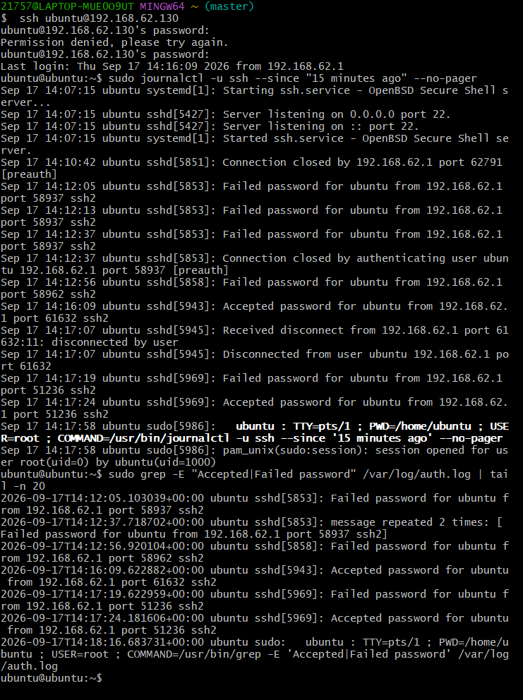
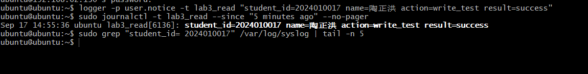

Lab3：Linux 日志事件分析与对照---

## 三、生成并查询本次实验日志

本实验直接生成所需的 SSH 认证记录和自定义日志，避免依赖 Lab2 的旧日志。

### 3.1 产生成功、失败认证记录并查询

使用完成 Lab2 时的 Ubuntu 虚拟机。先在 **Ubuntu 终端**查看用户名：

```bash
whoami
```

> 记录：本次使用的 Ubuntu 用户名为 ubuntu。

再查看当前 IP：

```bash
hostname -I
```

> 记录：本次SSH连接的 Ubuntu 目标 IP为 192.168.62.130。

再确认本机主机名，第二节 4W1R 中的 Where 就填这个值：

```bash
hostname
```

> 记录：本机主机名为ubuntu

然后在 Windows 中**重新打开一个 Git Bash 窗口**，将下面的用户名和 IP 换成刚才的真实值：

```bash
ssh student@192.168.80.128
```

出现密码提示时，只故意输入一次错误密码；看到 `Permission denied, please try again.` 后，输入正确密码完成登录。这样会在本次实验中生成失败和成功认证记录。本步骤使用本人账号，完成一次失败记录即可。

**在已登录的 Ubuntu 会话中查询认证日志**

先查询最近 15 分钟的 SSH journal 记录：

```bash
sudo journalctl -u ssh --since "15 minutes ago" --no-pager
```

`sudo` 用于读取系统日志，`-u ssh` 指定 SSH 服务，`--since "15 minutes ago"` 指定时间范围，`--no-pager` 表示直接输出。（服务单元名不一致、筛不出结果时，见第七节的备用查询。）

再查询文本认证日志：

```bash
sudo grep -E "Accepted|Failed password" /var/log/auth.log | tail -n 20
```

`grep -E` 按扩展正则表达式筛选；引号内的 `|` 表示“或者”，匹配 `Accepted` 或 `Failed password`。引号外的 `|` 是管道，把结果交给 `tail -n 20`，只保留最后 20 行。

核对用户名、时间和来源 IP，找到本人成功与失败认证记录。**日志中 `from` 后的来源 IP 是 Ubuntu 看到的客户端地址；刚才查到的虚拟机 IP 是本次连接的目标地址，两者作用不同。**

```text
Windows / Git Bash                          Ubuntu 虚拟机
  192.168.80.1  ──────── SSH 连接 ────────>  192.168.80.128
                                                   │
                                                   ▼
                             journal 与 auth.log 里：
                             sshd[1204]: ... from 192.168.80.1
                             （客户端地址，写在日志正文里）

  刚才 hostname -I 查到的 192.168.80.128
  （Ubuntu 自己的地址，填在 ssh 命令的 @ 右边）
```

两个地址不一样是正常的：一个是发起连接的 Windows，一个是接受连接的 Ubuntu。`from` 后面是前者，`hostname -I` 查到的是后者。

**在此填写本人认证结果**，注明所依据的日志来源。可以从两处输出中选取同一次成功和同一次失败认证进行核对，原始日志也可用于 4.2 节的分析。

| 认证事件 | 日志时间 | 尝试登录的账号 | 来源 IP | 结果关键词 | 日志来源 |
| :--- | :--- | :--- | :--- | :--- | :--- |
| 成功认证 |2026-09-17 14:16:09（+00:00 时区） |ubuntu |192.168.62.130 |Accepted password |/var/log/auth.log、journal 双入口均可查询 |
| 失败认证 |2026-09-17 14:12:05（+00:00 时区） |ubuntu |192.168.62.130
 |Failed password |/var/log/auth.log、journal 双入口均可查询 |

保存 `imgs/lab3_ssh_auth.png`，保留 journal 与 `auth.log` 的查询命令及本人成功、失败记录。两处输出**合起来**能辨认本人一次成功认证和一次失败认证即可，不要求每一处都同时出现两条记录。



接下来继续使用这个已登录 Ubuntu 的 SSH 会话完成 3.2 节。

### 3.2 写入并追踪自己的日志

将“你的学号”和“你的姓名”替换为真实信息：

```bash
logger -p user.notice -t lab3_read "student_id=你的学号 name=你的姓名 action=write_test result=success"
```

`logger` 将这条测试消息发送给本机日志系统，通常没有终端输出。接下来通过查询确认它是否被保存。

> **注意**：正文里的 `action=write_test` 和 `result=success` 是**你自己写在双引号里的文本**，不是日志系统作出的判断。日志里出现 `result=success`，只说明有人写下了这几个字符，不代表系统验证过任何事——日志里的字段不等于系统认可的事实。这一点在 4.1 节会用到。

| 命令部分 | 含义 |
| :--- | :--- |
| `logger` | 向本机日志系统发送消息 |
| `-p user.notice` | `-p` 指定 `facility.priority`；`user` 是普通用户程序类别，`notice` 是“值得注意但不代表故障”的级别 |
| `-t lab3_read` | `-t` 指定 tag，日志中会以 `lab3_read` 作为程序标签，便于精确查询 |
| 双引号中的内容 | 日志正文；空格分隔的 `key=value` 字段便于人和程序识别 |

先通过 journald 查询：

```bash
sudo journalctl -t lab3_read --since "5 minutes ago" --no-pager
```

再通过 rsyslog 文本文件查询：

```bash
sudo grep "student_id=你的学号" /var/log/syslog | tail -n 5
```

**`logger` 只执行一次。** 上面两条命令都只是“读取”日志，不会再次写入任何内容；所以两处出现的应该是**同一次写入**留下的同一条消息，而不是各写了一次。

两处应出现正文相同的记录，但显示格式和附带字段可能不同。先核对学号、姓名、时间与正文，再比较两条输出的共同点和不同点。

**在此填写两处查询结果的对照**：

| 项目 | 你的记录 |
| :--- | :--- |
| journal 中是否查到 |是，成功匹配到 `lab3_read` 标签的测试日志 |
| `/var/log/syslog` 中是否查到 |是 |
| 两处记录有哪些共同字段或正文 |正文完全一致：student_id=2024010017 name=陶正洪 action=write_test result=success；时间、主机名、日志标签字段对应一致 |
| 两处输出的主要区别 |journal 为 systemd 标准化输出格式，附带进程号等系统元数据；syslog 为传统纯文本行格式，时间显示精度与 journal 略有差异 |

保存 `imgs/lab3_dual_pipeline.png`，在同一张截图中保留 `logger` 命令、journal 和 syslog 两处查询结果，结果必须包含本人学号姓名。



> **知识点｜为什么写成 key=value**
> `student_id=20260001 action=write_test result=success` 这种“键=值”写法叫结构化日志：机器好解析，人也好读。即使只用 `grep` 搜索，字段名也比一整句自然语言更容易定位。

两套体系为什么能记录同一事件，在第五节第 1 题中解释。

#### logger 参数补充（选读）

以下是常见变体，供理解参数时参考。省略 `-p` 时通常使用 `user.notice`：

```bash
logger -t lab3_read "message=test"
```

指定 `user.err`，可以写入一条 err 级别测试消息：

```bash
logger -p user.err -t lab3_read "result=failed"
```

加 `-s`，可以在写入日志的同时把消息显示在当前终端：

```bash
logger -s -p user.notice -t lab3_read "message=test"
```

`-s` 表示同时写到标准错误；是否保存成功仍需通过查询确认。这些变体仅供参考，本次只需完成前面的 `notice` 消息写入和两处查询。

---

## 四、完成三份事件分析

**本节只需完成下面 3 题。** 前两题使用第三节取得的 SSH 认证记录和自定义日志；第三题再找一条软件包状态记录。其他日志不要求逐项检查、补写缺失说明或另做分析。

每题保留获取命令和原文，填写一张 4W1R 表，再用一两句话解释事件。缺少的字段写“该日志未提供”，不要补猜年份、用户或失败原因。格式示例仅用于理解，答案应来自本人的实际日志。本节不另要求截图。

填写时把 Who 和 What 分开：**Who 是参与事件的主体**（记录日志的程序、账号、来源地址或写入者），**What 是这个主体做了什么**。例如 Who 写 `lab3_read`，What 写“写入一条测试消息”，不要两格都写同一句话。

### 4.1 一条自定义日志：`/var/log/syslog`

直接选用 3.2 节中本人写入的一条 `lab3_read` 日志。已有原文时不用重查；需要重新获取时，把“你的学号”换成真实学号再执行：

```bash
sudo grep -F "student_id=你的学号" /var/log/syslog | tail -n 5
```

先找时间、主机名、程序标签和消息正文。`lab3_read` 是自己指定的日志标签，不是 Linux 用户名；正文中的学号、姓名用于标识这条测试记录。`action=write_test` 和 `result=success` 分别是自己写入的测试动作和结果标记，不是系统自动作出的成功判定。

**格式示例：自定义日志（lab3_read）**

下面这行格式示例展示 syslog 中这类记录的读法，报告中的表格要换成自己查到的真实记录：

```text
获取命令：sudo grep -F "student_id=2024010017" /var/log/syslog | tail -n 5
日志原文：Sep 17 14:55:36 ubuntu lab3_read[2310]: student_id=2024010017 name=陶正洪 action=write_test result=success
```

| 4W1R 问题 | 本例怎样填写 |
| :--- | :--- |
| When 什么时候 |9 月 17 日 14:55:36；该显示未提供年份和时区  |
| Where 在哪里 | 主机 `ubuntu` |
| Who 谁 |自定义标签 lab3_read（进程号 2310）；日志正文标识本人学号 2024010017，姓名陶正洪 |
| What 做了什么 | 向本机日志系统写入一条 write_test 测试日志消息 |
| Result 结果如何 |正文标记 result=success，为手动写入的测试标记，结合 journal 查询结果可印证日志写入成功 |

**人话解释**：9 月 17 日 14:55:36，本人在 ubuntu 主机上通过 logger 命令写入了带本人学号、姓名的测试日志，`result=success`是手动填写文本，并非系统判定结果，该消息成功被日志系统接收保存。


### 4.2 一条 SSH 认证记录：`/var/log/auth.log`

直接选用 3.1 节中本人 SSH 成功或失败的一条记录，只分析其中一条即可。已有原文时不用重查；需要重新获取时再执行：

```bash
sudo grep -E "Accepted|Failed password|sudo" /var/log/auth.log | tail -n 30
```

核对记录中的账号、时间和来源地址，选择自己的事件。`Accepted password` 表示密码认证成功，`Failed password` 表示这次密码认证失败。填写 Who 时区分“记录程序 `sshd`”和“尝试登录的账号”；来源 IP 不能单独证明实际操作者的身份。

模式中同时列出 `sudo`，是因为前面用 `sudo` 查日志也会在 `auth.log` 里留下记录。本题只选本人的 SSH 认证记录（`Accepted password` 或 `Failed password`），`sudo` 行忽略即可。

**本题填写**
```text
获取命令：sudo grep -E "Accepted|Failed password" /var/log/auth.log | tail -n 20
日志原文：2026-09-17T14:12:05.103039+00:00 ubuntu sshd[5853]: Failed
password for ubuntu from 192.168.62.1 port 58937 ssh2
```

| 4W1R | 根据本人原始日志填写 |
| :--- | :--- |
| When 什么时候 |2026 年 9 月 17 日 14:12:05；时区 +00:00 |
| Where 在哪里 |主机 ubuntu|
| Who 谁 |SSH 服务程序 sshd（进程号 5853）记录；尝试登录账号为 ubuntu，来源客户端 IP：192.168.62.1 |
| What 做了什么 |客户端对本机 ubuntu 账号发起 SSH 密码登录尝试 |
| Result 结果如何 |密码认证失败，依据日志关键字Failed password |

**用一两句话解释这个事件：**

> 填写：2026‑09‑17 14:12:05，来自 192.168.62.1 的客户端尝试使用 ubuntu 账号进行 SSH 密码登录，本次密码校验失败，该记录为实验中故意输入错误密码产生。

### 4.3 一条软件包状态记录：`/var/log/dpkg.log`

前两题分析的都是登录类事件，本题换成另一种事件类型：**软件包安装事件**，用来观察 4W1R 是否同样适用于非登录类日志。要分析的对象是“一次软件包状态变化”，`htop` 只是用来制造这个事件的小工具，不需要学习或使用它。

为保证每位同学都有一条可分析的软件包状态记录，先在 Ubuntu 中安装一款指定的小工具 `htop`：

```bash
sudo apt update
sudo apt install -y htop
```

安装完成后查询 dpkg.log 中 htop 相关的状态记录，选取其中一条：

```bash
grep "htop" /var/log/dpkg.log | tail -n 10
```

**格式示例：软件包状态记录**

```text
实际日志来源（使用替代来源时说明原因）：/var/log/dpkg.log，本次成功安装htop并获取到完整状态记录
获取命令：grep "htop" /var/log/dpkg.log | tail -n 10
日志原文：2026-09-17 15:01:46 status installed htop:amd64 3.3.0-4build1
```

先把这行分成“时间、状态、软件包、版本”。其中 `status installed` 表示软件包处于已安装状态，`amd64` 表示软件包的处理器架构。

如果查到的记录时间是**很早以前**，说明这台虚拟机此前已经装过 `htop`，本次安装没有产生新的安装记录；此时如实注明情况，继续分析这条历史记录即可，不必反复重装。

| 问题 | 本例怎样填写 |
| :--- | :--- |
| When 什么时候 | 2026 年 9 月 8 日 10:05:00；该日志未提供时区 |
| Where 在哪里 | 该日志未提供主机名；可以另注“从本人 Ubuntu 虚拟机的 `/var/log/dpkg.log` 取得” |
| Who 谁 | 记录工具为 `dpkg`；该日志未提供执行操作的用户账号 |
| What 做了什么 | 记录 `htop` 软件包的状态 |
| Result 结果如何 | 状态为 installed，htop 软件包已安装；仅本行无法区分是首次安装还是升级 |

**人话解释**：2026 年 9 月 17 日 15:01:46，软件包管理工具 dpkg 记录 htop 软件包状态为已安装，该日志没有记录是哪个用户执行本次安装操作。


---

## 五、知识问答

每题用一至三句话回答，无需另外做实验。

1. systemd-journald 与 rsyslog 各负责什么？结合 3.2 节的结果，解释它们为什么可以同时保留同一条日志。

   > 填写：systemd-journald 是 systemd 内置的日志服务，负责接收全系统的日志消息并以二进制格式存储在 journal 中，支持高效结构化查询。rsyslog 是传统 syslog 服务，负责接收 journald 转发的日志，以纯文本格式持久化保存到 /var/log 目录下的各类日志文件。同一条日志先由 journald 接收写入二进制 journal，同时 journald 会将消息转发给 rsyslog 进程，rsyslog 再按规则写入文本日志文件，因此两处可以同时保留同一条日志。

2. SSH 提示 `Failed password` 能证明什么，不能证明什么？请结合本次记录回答。

   > 填写：Failed password 能证明本次 SSH 登录尝试的密码校验未通过，发生了一次密码错误的登录事件。但它不能证明是恶意入侵攻击，也不能证明账号本身存在异常，本次记录中的失败就是本人故意输入错误密码产生的，仅代表单次密码输入失误。

---

